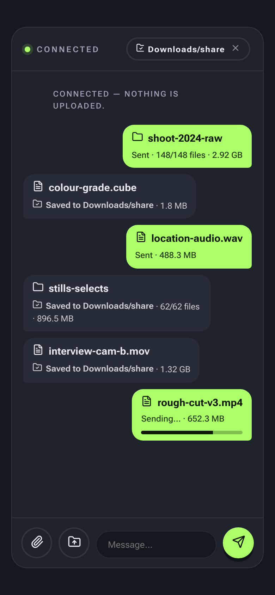
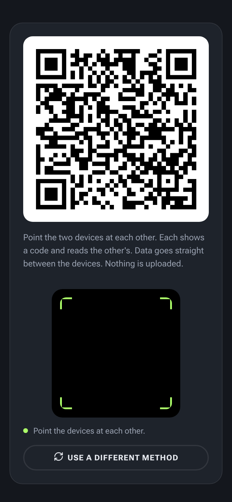

# share.gnass.buzz

Peer-to-peer messaging and file transfer, straight between two devices — no
account, no server. WebRTC data channels carry everything; the connection
handshake is exchanged by QR code (point the devices at each other) or a
link/pasted code. On the same network nothing external is contacted at all; a
STUN server is opt-in for connecting across networks.

Built with Preact + Signals in TypeScript.

<p align="center">
  
  &nbsp;&nbsp;
  
</p>

## How it works

- **Start screen:** a short intro explains the flow; "Connect a device" opens the
  method chooser. Scanned/hand-off links skip straight past it.
- **Pair:** QR, or a link.
  - **QR:** each device shows a code and reads the other's with its camera on one
    side-by-side screen; codes auto-detect and connect. Both devices offer *and*
    answer, and the first data channel to open wins — so there are no roles to
    agree on and no order to get right.
  - **Link:** share a link over any chat and paste the reply back. Works anywhere.
- **SDP compaction:** only the variable WebRTC fields are shipped (packed to
  ~130 bytes) and a full SDP is rebuilt from a template, keeping the QR and link
  small.
- **Installable (PWA):** a manifest + service worker make it installable to the
  home screen and usable offline (pairing is peer-to-peer, so no server is needed
  once loaded).

## License

MIT — see [LICENSE](LICENSE).

## Develop

```bash
npm install
npm run dev
npm run screenshot  # regenerate the README screenshots (Playwright)
```

The screenshots above are generated, not hand-captured: `?demo=<scene>` stages a
deterministic frame of the real UI (see `src/demo.ts`) and `npm run screenshot`
drives a headless browser to capture it at 780 × 1688. Re-run it whenever the UI
changes.

## Build

```bash
npm run build
```

Produces a static site in `dist/` (an `index.html` plus hashed JS/CSS/font
assets) that can be hosted anywhere. Serve over HTTPS so the camera and mic work.

Pushing to `main` deploys to GitHub Pages via `.github/workflows/deploy.yml`.
